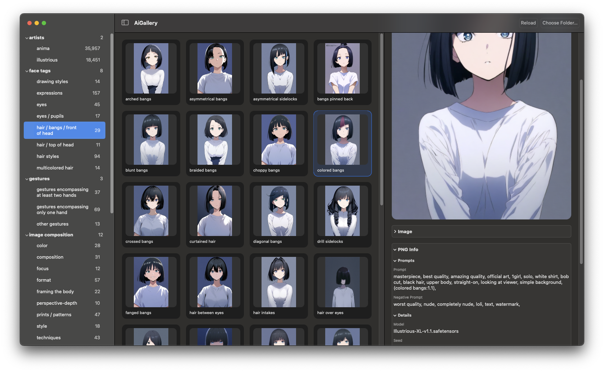

# AiGallery

AiGallery is a lightweight native macOS app for browsing AI-generated images from local folders.

It was built as a simple, fast, offline alternative to browser-based tools like `tagexplorer.github.io`. The goal is to keep the experience local and responsive: no web app, no server, no upload step, and no dependency on being online.

## Screenshot



## What It Does

AiGallery scans a root folder, treats subfolders as categories, and shows the images in a three-pane browser:

- A sidebar with folder-driven categories
- A central grid of image thumbnails
- An inspector with image details and PNG generation metadata

The inspector currently shows:

- Basic file info such as tag, filename, and path
- PNG metadata commonly embedded by AI image tools
- Human-readable prompt and generation settings when available
- Collapsible info sections for keeping the sidebar tidy

## Why It Exists

Web-based gallery tools are useful, but sometimes the best workflow is a local one:

- Faster to open and browse
- Works offline
- Keeps image libraries private on your machine
- Feels more like a native file browser than a website

This app exists to provide that kind of lightweight local viewer for AI image sets.

## Folder Layout

AiGallery is built around folders on disk.

Each subfolder inside the selected root is treated as a category. Images inside those folders are shown in the browser. The app supports common image types including:

- `png`
- `jpg`
- `jpeg`
- `webp`

The category naming was originally shaped around the folder layout used in the TagExplorer repository, but you can also point the app at your own image folder structure.

## How To Use It

You can use AiGallery in two main ways:

1. Point it at your own folder of AI-generated images.
2. Use the existing `gens` folder from the TagExplorer repo, which is how the app was originally developed and tested.

When the app launches, it will try to use a local `gens` folder if one exists beside the project. You can also click `Choose Folder…` at any time to switch to another root folder.

## Current Focus

AiGallery is intentionally simple. The emphasis right now is:

- Fast local browsing
- Clear folder-based organization
- Readable PNG info in the inspector
- A lightweight native SwiftUI macOS interface

## Build

From the project root:

```bash
swift build
```

## Summary

AiGallery is a local offline image browser for AI art folders. If you like the idea of tools such as TagExplorer but want something native, simple, and fast on macOS, that is exactly what this app is for.

## Disclaimer

This project was built with the help of AI coding tools, primarily Codex.
I am not a professional developer, so this repository is a vibe coded personal solution, but someone else might find it useful too.
If you decide to use it, expect there may be bugs, rough edges, or missing features.

