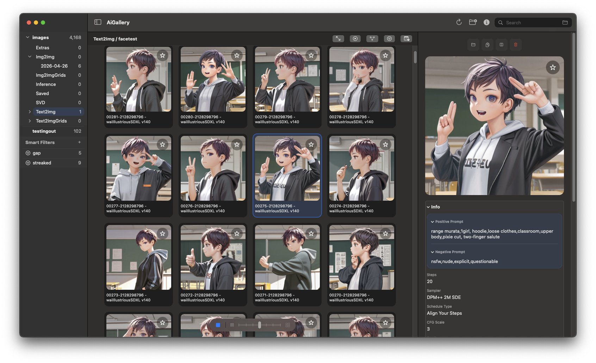

# AiGallery

AiGallery is a native macOS image browser for local AI-generated image collections. Point it at your folders, browse by subfolder, search your prompts, and inspect generation metadata — all local, no accounts, no cloud.

It started as a tool for browsing [TagExplorer](https://github.com/tagexplorer/tagexplorer.github.io)-style sample folders, but has grown into a general-purpose local AI image browser.

**v2.0 is a significant update.** Multi-root folders, persistent metadata search, smart filters, and the TagExplorer legacy mode has been retired.

## Screenshot



## What It Does

- Add multiple root folders — each appears as its own collapsible section in the sidebar
- Browse by subfolder; every folder in the tree is a navigation target
- Fast scrollable thumbnail grid
- Reads embedded PNG generation metadata (supports Automatic1111, ComfyUI, and DrawThings formats)
- Search filenames and prompt text across all your folders at once
- Filter by model, sampler, scheduler, VAE, or upscaler from the filter bar
- Save searches as Smart Filters — persistent sidebar folders that always stay current
- Move images to Trash from the keyboard, menu, or right-click
- Reveal any image in Finder
- Drop a PNG anywhere on the window to inspect its metadata without adding it to the library
- Everything stays local and offline

## Folder Layout

Point AiGallery at any folder of images. Subfolders become sidebar categories automatically.

```text
My Images/
├─ Characters/
│  ├─ Fantasy/
│  └─ Sci-Fi/
├─ Landscapes/
└─ Studies/
```

Supported formats: `png` `jpg` `jpeg` `webp`

## PNG Metadata

AiGallery reads embedded PNG text chunks from Automatic1111, ComfyUI, and DrawThings outputs. If a folder contains images without embedded metadata, you can drop a fallback metadata file in the folder:

Supported filenames: `aigallery.json` · `aigallery.cfg` · `metadata.json` · `metadata.cfg`

```json
{
  "prompt": "portrait of a fantasy mage, dramatic lighting",
  "negativePrompt": "blurry, low quality",
  "parameters": {
    "Model": "illustrious-xl",
    "Sampler": "DPM++ 2M Karras",
    "Steps": 30
  }
}
```

Embedded metadata takes priority when present.

## Using It

1. Launch the app
2. Click the `+` toolbar button or use **File → Add Root Folder** to add a folder
3. Folders load when you first expand them in the sidebar
4. Use the search bar to search filenames and prompt text
5. Use the filter bar (funnel icon) to narrow by model, sampler, or other fields
6. Right-click the folder header in the sidebar to remove a root

## Building from Source

Requires macOS 13+ and Xcode or Swift toolchain.

```bash
swift build
```

To build the app bundle:

```bash
./scripts/build-app.sh
```

The app bundle is unsigned — macOS may flag it on first launch. Right-click → Open, or clear the quarantine flag:

```bash
xattr -dr com.apple.quarantine AiGallery.app
```

## Notes

- Coded with significant AI assistance (Claude). Bugs are expected and the code reflects that. Use at your own risk and read the source if something seems off.
- This is a personal project that keeps changing. No guarantees about stability or backwards compatibility.
- Metadata indexes are stored in `~/Library/Application Support/AiGallery/` as SQLite files, one per root folder.
