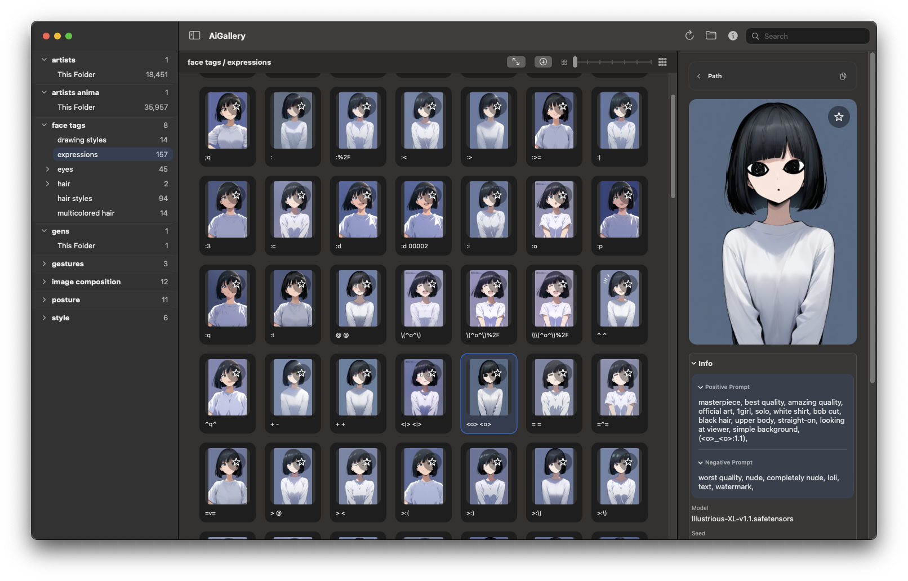

# AiGallery
AiGallery is a native macOS image browser for local AI image folders, with built-in PNG info reading and simple folder-based browsing.

It started out as a way to browse TagExplorer.github.io-style sample folders, but the goal now is broader and simpler: point it at a folder of images on your Mac and browse them like a lightweight local gallery with metadata.

## Screenshot

Replace this with a current screenshot after the UI refresh.



## What It Does

- Scans a root folder and builds the sidebar from the folders it finds
- Shows thumbnails in a fast scrollable grid
- Reads embedded PNG info when present
- Falls back to folder-level metadata files for formats that do not carry PNG info well
- Lets you inspect a single dropped PNG without adding it to the library
- Keeps everything local and offline

## What Changed In This Branch

This branch is the point where AiGallery stops treating the TagExplorer `gens` folder structure as the main way to use the app.

The aim now is:

- make AiGallery useful as a general local PNG info viewer and image browser
- treat normal folders as normal folders by default
- keep TagExplorer compatibility as an optional legacy mode
- simplify the inspector so it feels more like file info plus PNG info, not a tag browser

## What Changed Since 0.1.9

- General browsing is now the default direction of the app instead of the TagExplorer layout being the center of the design
- TagExplorer handling was moved behind a legacy mode toggle instead of being assumed everywhere
- The inspector was reworked into a simpler single info module
- The app now has a first-run welcome flow with a plain folder-open path and an optional legacy mode foldout
- Legacy TagExplorer-derived assets and support files were removed from this branch so the project is cleaner to work on

## Folder Layout

AiGallery now works best when you point it at a normal folder tree of images.

Each folder with images becomes a category. Nested folders become nested categories in the sidebar.

```text
Root Folder/
├─ Artists/
│  ├─ Illustrious/
│  └─ Realistic/
├─ Lighting/
│  └─ Golden Hour/
└─ Poses/
   ├─ Arms/
   └─ Standing/
```

Supported image formats:

- `png`
- `jpg`
- `jpeg`
- `webp`

## PNG Info And Folder Metadata

AiGallery reads embedded PNG text metadata when it exists.

If a folder contains images that do not carry good embedded metadata, you can also add a folder-level metadata file and AiGallery will use it as fallback info for images in that folder.

Supported filenames:

- `aigallery.json`
- `aigallery.cfg`
- `metadata.json`
- `metadata.cfg`

Example `aigallery.json`:

```json
{
  "prompt": "portrait of a fantasy mage, detailed robe embroidery, dramatic lighting",
  "negativePrompt": "blurry, low quality, extra fingers",
  "parameters": {
    "Model": "illustrious-xl",
    "Sampler": "DPM++ 2M Karras",
    "Steps": 30,
    "CFG Scale": 6.5
  },
  "details": {
    "Batch": "iteration 04",
    "Source": "Inspiration Gens"
  }
}
```

Example `aigallery.cfg`:

```ini
prompt=portrait of a fantasy mage, detailed robe embroidery, dramatic lighting
negative_prompt=blurry, low quality, extra fingers
Model=illustrious-xl
Sampler=DPM++ 2M Karras
Steps=30
CFG Scale=6.5
Batch=iteration 04
Source=Inspiration Gens
```

Embedded PNG metadata still takes priority when present.

## Using It

On first launch, AiGallery opens a welcome panel.

- If you just want to browse your own folders, click `Open Image Folder`
- If you want old TagExplorer compatibility, open the `Legacy Mode` foldout and enable it first

After that, you can change folders from the app and switch legacy mode from the menu.

## Legacy Mode

Legacy mode is still here for people who want to use the large [TagExplorer.github.io](https://github.com/tagexplorer/tagexplorer.github.io) `gens` tag gallery folder setup.

When legacy mode is enabled:

- AiGallery can interpret the old TagExplorer-style category naming more cleanly
- the app can still work with a local `gens` folder if you want that workflow

If you do not need that, you can ignore legacy mode completely and just use your own folders.

## Build

From the project root:

```bash
swift build
```

To build the app bundle:

```bash
./scripts/build-app.sh
```

## Notes

- The app bundle is unsigned, so macOS may block it until you allow it in system settings or clear the quarantine flag manually
- This is still a small personal project and it will probably keep changing
- If you want the exact implementation details, the code is simple enough to read without too much digging
